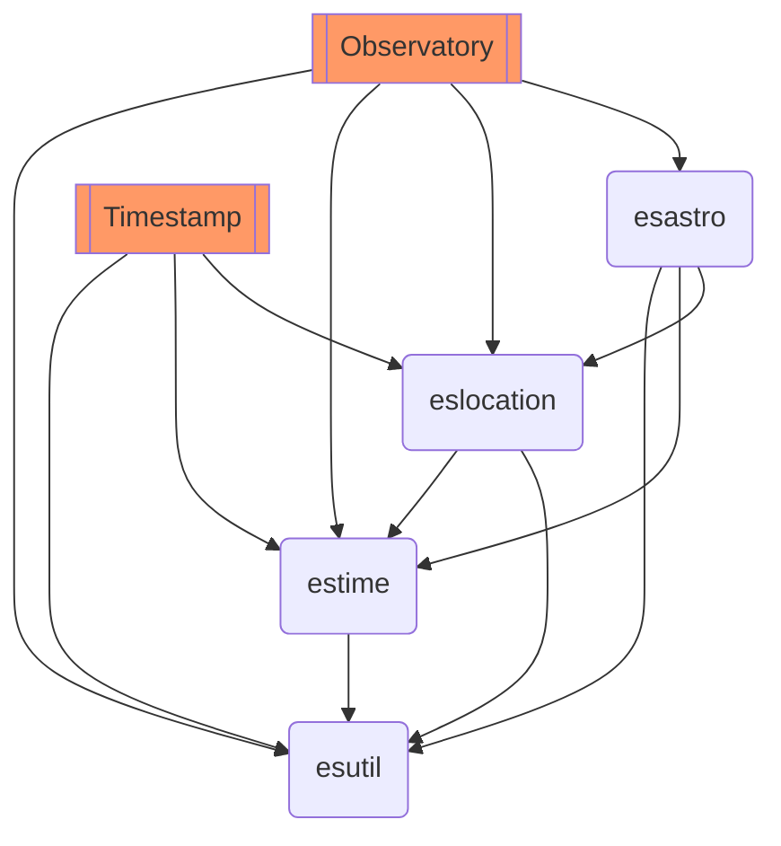

# Emerald Sequoia code

## Overview

This GitHub area contains apps and libraries used in the development of iOS apps originally authored by Emerald Sequoia LLC.

## Apps, Libraries, and Tools

The apps are:

*   Emerald Timestamp [`timestamp`]: the single iOS iPhone+iPad app "Timestamp" (Objective-C++)
*   Emerald Observatory [`observatory`]: the single iOS iPad app "Observatory" (Objective-C++)
*   Emerald Chronometer [`chronometer`]:

    *   The iPhone app "Chronometer" (Objective-C++)
    *   The iPad app "Chronomter for iPad" (Objective-C++)
    *   (Note: The WearOS app "Emerald Chronometer" and its subset apps, using Java and C++ via JNI, are
        not included here).

The libraries are:

*   `esutil`: A base set of common utilities (including threading) written in C++
*   `estime`: A set of utilities that provide NTP-corrected time
*   `eslocation`: A set of utilities that provide location, either through the device or selected by the user
*   `esastro`: A set of utilities for various astronomical calculations, including a caching manager

The tools are:
*   `buildscripts`: A collection of scripts used as part of the app or library build process.

Not all apps use the libraries. For Emerald Timestamp and Emerald Observatory, the dependency tree looks like this:



The iOS Chronometer apps do not use these libraries; they contain similar code that predated the creation of the libraries.

## Installing

All library and app directories must live at the same level (they refer to each other using relative `../` paths). So, for example, to use [ssh](https://docs.github.com/en/authentication/connecting-to-github-with-ssh) to download all of the necessary components for Emerald Timestamp:

```shell
mkdir emeraldsequoia
cd emeraldsequoia
git clone git@github.com:EmeraldSequoia/Timestamp.git
git clone git@github.com:EmeraldSequoia/buildscripts.git
git clone git@github.com:EmeraldSequoia/esutil.git
git clone git@github.com:EmeraldSequoia/estime.git
git clone git@github.com:EmeraldSequoia/eslocation.git
```

## Using Xcode

A Mac with Xcode installed is required.

The Xcode project for each app includes all of the dependent library
projects that it needs, to simplify development as you work on one
app: You can edit library code within the same Xcode window as the
app. Note that this means when you are ready to commit your changes,
you will also need to commit any library code that you have edited.

Xcode is a very complicated app and is beyond the scope of this
document, but each app directory's README has some instructions about
where to find the project file and what to build.
